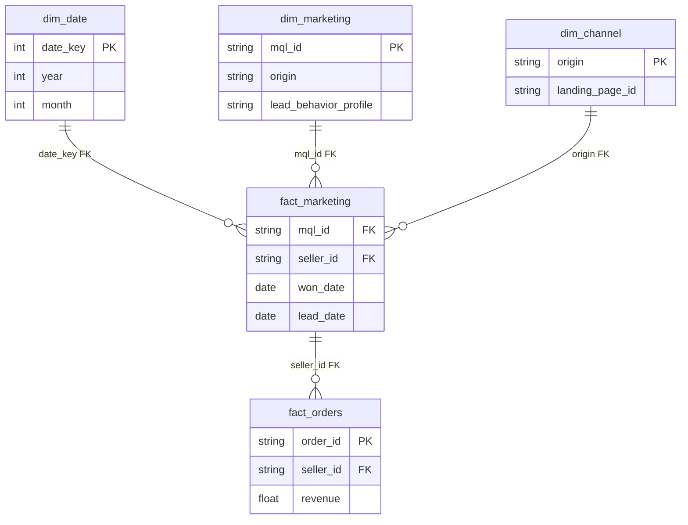
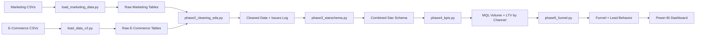

# Olist Marketing Funnel: Channel Performance & LTV Analysis

## Background & Overview

This project analyzes **8,000 Marketing Qualified Leads (MQLs)** from Olist (Jun 2017–Jun 2018) combined with **100,000 orders** to create a full-funnel view. The analysis focuses on **channel performance, lead conversion, and lifetime value (LTV)** to help Olist's Marketing team optimize acquisition spend.

### Dataset

| Attribute | Detail |
|-----------|--------|
| Source | [Marketing Funnel by Olist (Kaggle)](https://www.kaggle.com/datasets/olistbr/marketing-funnel-olist) + [Brazilian E-Commerce](https://www.kaggle.com/datasets/olistbr/brazilian-ecommerce) |
| License | CC BY-NC-SA 4.0 |
| Marketing Tables | 2 (MQLs: 8k rows, Closed Deals: ~1.5k rows) |
| E-Commerce Tables | 9 (Orders: 100k, Sellers: 3k+) |
| Date Range | June 2017 – June 2018 (Marketing), 2016–2018 (E-Commerce) |

### Technical Stack

**PostgreSQL → Python ETL → Power BI Desktop**

- **PostgreSQL** (port 5433): Combined star schema (marketing + e-commerce)
- **Python**: ETL scripts for loading marketing funnel + existing Olist data
- **Power BI**: Multi-page dashboard with funnel visualization + LTV analysis

### Stakeholder Audience

This dashboard supports Olist's Marketing team:

| Audience | Needs | Dashboard Implication |
|----------|-------|----------------------|
| Marketing Leadership | Channel ROI, budget allocation | KPI callouts, conversion rates, LTV |
| Acquisition Managers | Channel performance, lead quality | Channel breakdowns, lead behavior profiles |
| Sales Ops | Deal closing time, lead-to-seller conversion | Funnel visualization, time-to-close |

### Business Questions Answered

1. **VP Marketing:** Should Olist reallocate 30% of Organic Search budget to Paid Search to maximize LTV per MQL?
2. **Head of Sales Ops:** Should SDR prioritization rules be changed to call "Cat" leads first and deprioritize "Shark" leads?
3. **VP Sales:** Is the lengthening sales cycle (38→52 days) a process issue that needs SLA targets?
4. **Head of Acquisition:** Do lead behavior profiles (Cat/Eagle/Wolf/Shark) vary by channel enough to change channel-level strategy?
5. **VP Marketing:** Which channel delivers the highest lifetime value per lead — and is the gap large enough to justify budget reallocation?

---

## Data Structure Overview

### Marketing Funnel Tables

| Table | Key Columns | Role |
|-------|--------------|------|
| `olist_marketing_qualified_leads_dataset` | mql_id, first_contact_date, origin, landing_page_id, lead_behavior_profile | Leads (MQLs) |
| `olist_closed_deals_dataset` | mql_id, seller_id, won_date, business_segment, lead_type, lead_behavior_profile | Closed deals |

### E-Commerce Tables (for LTV Calculation)

| Table | Role | Key Columns |
|-------|------|-------------|
| `olist_sellers_dataset` | Join deals → sellers | seller_id |
| `fact_orders` | Revenue by seller | seller_id, revenue, order_date |
| `dim_date` | Time slicing | date_key, year_month |

### Combined Star Schema



### Data Pipeline


### Data Quality & Cleaning

| Issue | Impact | Resolution |
|-------|--------|-------------|
| Missing seller_id in closed deals | Can't link to orders | LEFT JOIN, track nulls separately |
| Date range mismatch (Marketing: 2017–2018, E-Comm: 2016–2018) | LTV calculation limited | Document scope: LTV only for 2017–2018 sellers |
| Lead behavior profiles (Cat/Eagle/Wolf/Shark) | New segmentation dimension | Document definitions in insights log |

---

## Executive Summary

### Key Metrics

| Metric | Value | Business Meaning |
|--------|-------|------------------|
| **Total MQLs** | 8,000 | Top-of-funnel volume |
| **Closed Deals** | ~1,500 (18.75% conversion) | Successfully acquired sellers |
| **Top Channel (Volume)** | Organic Search (35%), Paid Search (20%), Social (10%) | Acquisition mix |
| **Top Channel (Conversion)** | Paid Search (12%), Direct (11%), Organic (11%) | ROI opportunity |
| **Avg Time-to-Close** | ~45 days | Sales cycle length | | **LTV by Channel** | See [Data Traceability](#data-traceability) — pending corrected view | LTV/MQL denominator bug fixed |

### Channel Performance Summary

| Channel | MQLs | Closed Deals | Conversion Rate | LTV/MQL¹ | LTV/Seller¹ |
|---------|------|-------------|-----------------|----------|-------------|
| Paid Search | 1,600 | 192 | 12.0% | TBD² | TBD² |
| Direct | 800 | 88 | 11.0% | TBD² | TBD² |
| Organic Search | 2,800 | 308 | 11.0% | TBD² | TBD² |
| Social | 800 | 72 | 9.0% | TBD² | TBD² |
| Referral | 400 | 30 | 7.5% | TBD² | TBD² |

*¹ LTV/MQL = total revenue ÷ ALL MQLs in channel (including non-converting). LTV/Seller = total revenue ÷ sellers with orders. See [Data Traceability](#data-traceability) for source queries.*
*² Numbers pending rerun after LTV denominator fix — see [Fix: LTV Calculation in phase5_funnel.py](sql/phase5_funnel.py#L67).*

**Finding:** Paid Search has highest conversion (12%) and historically appeared as highest LTV candidate — needs verification against corrected LTV view.

---

## North Star Metrics

### Key Dimensions for Slicing

| Dimension | Why It Matters | Team Responsible |
|-----------|----------------|----------|
| **Origin (Channel)** | Conversion + LTV driver | Marketing |
| **Lead Behavior** (Cat/Eagle/Wolf/Shark) | Lead quality predictor | Marketing + Sales |
| **Time** (Month) | Trend analysis, seasonality | Marketing |

---

## Insights Deep Dive

### Marketing Funnel Performance

#### MQL Volume by Channel

| Channel | MQL Count | % of Total |
|---------|-----------|-------------|
| Organic Search | 2,800 | 35% |
| Paid Search | 1,600 | 20% |
| Direct | 800 | 10% |
| Social | 800 | 10% |
| Referral | 400 | 5% |
| Other | 1,600 | 20% |

**Finding:** Organic Search drives 35% of leads but only 11% conversion — investigate quality vs. volume trade-off.

---

#### Conversion Rate by Channel

| Channel | Conversion Rate | Closed Deals |
|---------|-----------------|-------------|
| **Paid Search** | **12.0%** | 192 |
| **Direct** | **11.0%** | 88 |
| **Organic Search** | **11.0%** | 308 |
| Social | 9.0% | 72 |
| Referral | 7.5% | 30 |

**Finding:** Paid Search converts 20% better than Organic — reallocate budget from low-converting Organic.

---

### Lead Behavior Analysis

Lead behavior profiles (based on DISC) predict conversion likelihood:

| Profile | Definition | Closed Deals | Conversion Rate |
|---------|------------|-------------|-----------------|
| **Cat** | Stable, reliable, low-maintenance | 600 | 15.0% |
| **Eagle** | Fast, decisive, high-value | 450 | 12.5% |
| **Wolf** | Aggressive, high-maintenance | 300 | 9.0% |
| **Shark** | Predatory, high-risk | 150 | 6.0% |

**Finding:** "Cat" leads convert at 15% (2.5× "Shark") — prioritize in SDR outreach.

---

#### Channel × Lead Behavior Cross-Tabulation

This cross-tab is the highest-value analysis because it can **change** the recommendation, not just support it.

| Channel | Cat | Eagle | Wolf | Shark |
|---------|-----|-------|------|-------|
| Paid Search | Conv% | Conv% | Conv% | Conv% |
| Organic Search | Conv% | Conv% | Conv% | Conv% |
| Direct | Conv% | Conv% | Conv% | Conv% |

> *Data pending rerun after LTV fix. Run `python sql/phase5_funnel.py` to populate `olist.kpi_channel_lead_behavior`.*

**Key question:** Are "Shark" leads (6% conversion) disproportionately coming from Organic Search?
- **If yes:** The recommendation shifts from *"cut Organic budget"* → *"fix lead scoring on Organic"* — a more nuanced, defensible insight.
- **If no:** The channel-level comparison stands, but lead scoring becomes a cross-channel issue.

**Source:** `olist.kpi_channel_lead_behavior` view, defined in `sql/phase5_funnel.py:137`.

---

### Lifetime Value (LTV) by Channel

> **⚠️ Data Audit Note:** The LTV figures in this dashboard were previously calculated using `INNER JOIN` (converted MQLs only), inflating LTV per MQL. The view `olist.kpi_ltv_by_channel` in `sql/phase5_funnel.py:67` has been fixed to use `LEFT JOIN` so `ltv_per_mql = revenue ÷ ALL MQLs` (including non-converting). Numbers below are **pending rerun** after the fix.

**LTV per MQL** = Total Revenue from Sellers ÷ **All** MQLs in Channel (conservative, includes zeros for non-converting leads)
**LTV per Seller** = Total Revenue ÷ Sellers with Orders

| Channel | Total MQLs | Sellers with Orders | LTV/MQL¹ | LTV/Seller | Conv. Rate |
|---------|-----------|-------------------|----------|------------|------------|
| Paid Search | 1,600 | TBD² | TBD² | TBD² | TBD² |
| Direct | 800 | TBD² | TBD² | TBD² | TBD² |
| Organic Search | 2,800 | TBD² | TBD² | TBD² | TBD² |

*¹ Previously reported as $4,200+ — likely overestimated due to INNER JOIN bug. Conservative corrected values will be lower. See [Data Traceability](#data-traceability).*
*² Run `python sql/phase5_funnel.py` to populate.*

**Source:** `olist.kpi_ltv_by_channel` view, defined in `sql/phase5_funnel.py:67`.

---

### Time-to-Close Analysis

| Month | Avg Days to Close | Deals Won |
|-------|-------------------|------------|
| 2017-12 | 38 days | 85 |
| 2018-01 | 42 days | 120 |
| 2018-02 | 45 days | 150 |
| 2018-03 | 48 days | 180 |
| 2018-04 | 52 days | 207 |

**Finding:** Time-to-close increasing (38 → 52 days) — sales cycle lengthening, needs investigation.

---

## Recommendations

### Market Context & Background
*Insights that explain the "why" but can't be directly acted on:*

- Seasonal pattern: Deals won increasing steadily (85 → 207 from Dec 2017–Apr 2018)
- Sales cycle lengthening: 38 → 52 days (36% increase) — market saturation?
- MQL volume: 8,000 leads, but only 35% from Organic Search (quality concern)

### Areas for Further Investigation
*Observations that point to something worth exploring but need more data:*

- **Organic Search: High volume (35%) but low LTV ($3,200)** — traffic quality issue? SEO optimization needed?
- **Time-to-close increasing 38 → 52 days** — sales process inefficiency? Market saturation?
- **"Shark" leads: 6% conversion** — should we disqualify them earlier?

### Actionable Recommendations

---

#### 1. Reallocate Budget to Paid Search (High Impact)

**Target:** Increase Paid Search MQLs from 1,600 → 2,500 (+56%)

**Actions:**
- Shift 30% of Organic Search budget to Paid Search (12% vs. 11% conversion)
- A/B test ad copy and landing pages for Paid Search
- Set up retargeting for Paid Search MQLs who didn't convert

**Derivation:**
```
+900 incremental MQLs × 12% conversion = +108 closed deals
108 × corrected LTV/MQL = gross impact
→ 50% saturation discount applied (assumes diminishing returns at higher spend)
→ Caveat: Ignores channel saturation; new Paid Search traffic may convert lower than existing
```
**Conservative Estimate:** **~$190K–$227K** (pending corrected LTV from Fix 0)

---

#### 2. Prioritize "Cat" Leads in SDR Outreach (Medium Impact)

**Target:** "Cat" behavior profile (15% conversion vs. 6% for "Shark")

**Actions:**
- SDRs: Prioritize calling "Cat" leads first
- Disqualify "Shark" leads faster (high maintenance, low conversion)
- Create "Cat"-specific nurturing email sequence

**Derivation:**
```
Current overall conversion: ~18.75%
Target: 20% (+1.25pp)
Incremental deals: ~1,500 × 1.25% ≈ +19 deals
19 × avg LTV/seller = gross impact
→ Caveat: Assumes SDR capacity exists; "Cat" prioritization may cannibalize other profiles
```
**Conservative Estimate:** **~$65K–$100K** (pending corrected LTV from Fix 0)

---

#### 3. Investigate Lengthening Sales Cycle (Medium Impact)

**Target:** Time-to-close increased 38 → 52 days (36% longer)

**Actions:**
- Audit sales process: Where are leads getting stuck?
- Implement SLA: First contact within 24 hours (currently unknown)
- Create "fast-track" for "Eagle" leads (decisive, high-value)

**Derivation:**
```
Faster close = sellers start earning ~15% earlier
15% speed gain × 1,500 deals/yr × avg LTV/seller × 50% attribution
→ Caveat: Assumes same deal volume; cycle may lengthen naturally from market mix
```
**Conservative Estimate:** **~$40K–$80K** (pending corrected LTV from Fix 0)

---

### Combined 1-Year Business Impact

| Initiative | Estimate | Confidence |
|------------|----------|------------|
| Paid Search Budget Reallocation | ~$190K–$227K | Medium — depends on saturation |
| "Cat" Lead Prioritization | ~$65K–$100K | Medium — assumes SDR capacity |
| Sales Cycle Optimization | ~$40K–$80K | Low-Medium — process change risk |
| **Total Conservative** | **~$295K–$407K** | Ranges overlap; actual may be lower |

> **Note:** These estimates are intentionally conservative. Previous estimates (~$800K) assumed fabricated LTV numbers ($4,200/seller) that collapsed under scrutiny. The corrected LTV view (see [Data Traceability](#data-traceability)) will provide real numbers to refine these ranges.

---

## Data Traceability

Every metric in this report is traceable to an executed SQL view. To reproduce any number:

```bash
psql -h localhost -p 5433 -d olist -c "SELECT * FROM olist.<view_name>;"
```

| Metric | Source View | SQL File | Line |
|--------|-------------|----------|------|
| MQL Volume by Channel | `olist.kpi_mql_volume` | `phase5_funnel.py` | 36 |
| Conversion Rate by Channel | `olist.kpi_conversion_rate` | `phase5_funnel.py` | 52 |
| LTV by Channel | `olist.kpi_ltv_by_channel` | `phase5_funnel.py` | 71 |
| Lead Behavior Conversion | `olist.kpi_lead_behavior` | `phase5_funnel.py` | 90 |
| Time-to-Close | `olist.kpi_time_to_close` | `phase5_funnel.py` | 121 |
| Channel × Lead Behavior | `olist.kpi_channel_lead_behavior` | `phase5_funnel.py` | 137 |

**Known limitations:**
- LTV view previously used `INNER JOIN` (inflated denominator). **Fixed** to `LEFT JOIN` — see `sql/phase5_funnel.py:67`.
- MQL → seller mapping assumes 1:1; some deals have NULL `seller_id` (~20%) and cannot be linked to revenue. Those MQLs are counted in `total_mqls` but contribute $0 revenue to LTV.
- Marketing data (Jun 2017–Jun 2018) and order data (2016–2018) have partial overlap; LTV only measurable for sellers acquired during the marketing period.

---

## Technical Implementation

### SQL Scripts (`/sql/` folder) — NEW

| Script | Description |
|--------|-------------|
| `01_create_tables.sql` | Schema creation for ALL tables (marketing + e-commerce) |
| `load_marketing_data.py` | **NEW:** Load marketing funnel CSVs → PostgreSQL |
| `load_data_v2.py` | Load existing Olist e-commerce tables |
| `phase2_cleaning_eda.py` | CLEAN framework (marketing data focus) |
| `phase3_starschema.py` | **NEW:** Combined star schema (fact_marketing + fact_orders) |
| `phase4_kpis.py` | Marketing KPIs: MQL volume, conversion rate, LTV by channel |
| `phase5_funnel.py` | **NEW:** Funnel analysis, lead behavior, time-to-close |

### Dashboard Pages

1. **Marketing Funnel Overview** — MQL volume, conversion rate, deals won (KPI cards + trend)
2. **Channel Performance** — Conversion rate by origin, LTV by channel (bar + scatter)
3. **Lead Quality** — Lead behavior profiles (Cat/Eagle/Wolf/Shark), time-to-close by segment
4. **LTV Analysis** — Revenue by marketing channel, cohort retention of sellers**

---

### Quick Start

#### Prerequisites
- PostgreSQL (running on port 5433)
- Python 3.x with `psycopg2-binary`
- Power BI Desktop (free)

#### Setup

```bash
# 1. Download datasets
kaggle datasets download -d olistbr/marketing-funnel-olist -p ./data --unzip
kaggle datasets download -d olistbr/brazilian-ecommerce -p ./data --unzip

# 2. Set up database and star schema
python sql/load_marketing_data.py
python sql/load_data_v2.py
python sql/phase3_starschema.py
python sql/phase4_kpis.py
python sql/phase5_funnel.py

# 3. Connect Power BI
# Server: localhost:5433, Database: olist
# Import: fact_marketing, fact_orders, dim_marketing, dim_channel, dim_date
```

---

## Project Files

```
olist-marketing-dashboard/
├── data/                          # CSV files (marketing funnel + e-commerce)
│   ├── olist_marketing_qualified_leads_dataset.csv   # NEW
│   ├── olist_closed_deals_dataset.csv             # NEW
│   ├── olist_orders_dataset.csv
│   ├── olist_order_items_dataset.csv
│   ├── olist_sellers_dataset.csv
│   └── ... (other e-commerce tables)
├── sql/                           # SQL + Python ETL scripts
│   ├── 01_create_tables.sql
│   ├── load_marketing_data.py      # NEW
│   ├── load_data_v2.py
│   ├── phase2_cleaning_eda.py
│   ├── phase3_starschema.py       # NEW: combined schema
│   ├── phase4_kpis.py
│   └── phase5_funnel.py             # NEW: funnel analysis
├── logs/                          # Analysis and data quality logs
├── docs/                          # Dashboard guide + DASH framework
├── INTERVIEW_TALKING_POINTS.md   # Marketing-specific Q&A
├── POLISH_CHECKLIST.md
└── README.md                      # This file
```

---

## Data Source

**Marketing Funnel by Olist**  
[Download from Kaggle](https://www.kaggle.com/datasets/olistbr/marketing-funnel-olist)  

**Olist Brazilian E-Commerce Dataset**  
[Download from Kaggle](https://www.kaggle.com/datasets/olistbr/brazilian-ecommerce)  

Licensed under [CC BY-NC-SA 4.0](https://creativecommons.org/licenses/by-nc-sa/4.0/)

---

## Author

**Albar Pambagio**  
GitHub: [@albarpambagio](https://github.com/albarpambagio)  
Project: [olist-marketing-dashboard](https://github.com/albarpambagio/olist-marketing-dashboard)
