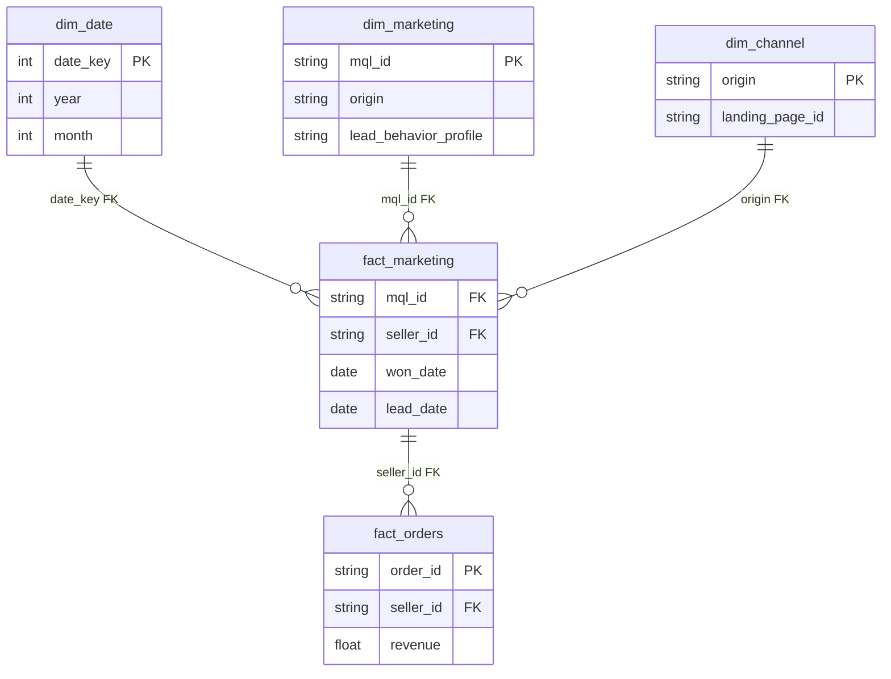
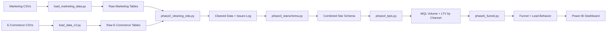

# Olist Marketing Funnel: Channel Performance & LTV Analysis

> **Scenario:** This analysis was prepared for **Olist's Q2 2018 Marketing Review**. The deliverable is a **channel strategy brief** supporting the VP Marketing in Q3 2018 budget allocation. The central question: which acquisition channels deliver the highest lifetime value per lead — and should the budget mix change?

## Background & Overview

This project analyzes **8,000 Marketing Qualified Leads (MQLs)** from Olist (Jun 2017–Jun 2018) combined with **100,000 orders** to create a full-funnel view. The analysis focuses on **channel performance, lead conversion, and lifetime value (LTV)** to support Olist's Marketing team in acquisition budget decisions.

### Dataset

| Attribute | Detail |
|-----------|--------|
| Source | [Marketing Funnel by Olist (Kaggle)](https://www.kaggle.com/datasets/olistbr/marketing-funnel-olist) + [Brazilian E-Commerce](https://www.kaggle.com/datasets/olistbr/brazilian-ecommerce) |
| License | CC BY-NC-SA 4.0 |
| Marketing Tables | 2 (MQLs: 8k rows, Closed Deals: 842 rows) |
| E-Commerce Tables | 9 (Orders: 100k, Sellers: 3k+) |
| Date Range | June 2017 – June 2018 (Marketing), 2016–2018 (E-Commerce) |

### Technical Stack

**PostgreSQL → Python ETL → Power BI Desktop**

- **PostgreSQL** (port 5433): Combined star schema (marketing + e-commerce)
- **Python**: ETL scripts for loading marketing funnel + existing Olist data
- **Power BI**: Multi-page dashboard with funnel visualization + LTV analysis

### Stakeholder Audience

This dashboard supports Olist's Marketing team:

| Audience | Needs | Dashboard Implication |
|----------|-------|----------------------|
| Marketing Leadership | Channel ROI, budget allocation | KPI callouts, conversion rates, LTV |
| Acquisition Managers | Channel performance, lead quality | Channel breakdowns, lead behavior profiles |
| Sales Ops | Deal closing time, lead-to-seller conversion | Funnel visualization, time-to-close |

### Business Questions Answered

1. **VP Marketing:** Should Olist reallocate 30% of Organic Search budget to Paid Search to maximize LTV per MQL?
2. **Head of Acquisition:** Do lead behavior profiles at deal stage reveal channel composition differences that should inform channel strategy — specifically, why does Social produce nearly twice the Wolf-profile sellers as other channels?
3. **VP Sales:** Is the sales cycle compressing (44→24 days) sustainable, or will it revert as deal volume grows?
4. **Head of Acquisition:** Do lead behavior profiles (Cat/Eagle/Wolf/Shark) vary by channel enough to change channel-level strategy?
5. **VP Marketing:** Which channel delivers the highest lifetime value per lead — and is the gap large enough to justify budget reallocation?

---

## Data Structure Overview

### Marketing Funnel Tables

| Table | Key Columns | Role |
|-------|--------------|------|
| `olist_marketing_qualified_leads_dataset` | mql_id, first_contact_date, origin, landing_page_id, lead_behavior_profile | Leads (MQLs) |
| `olist_closed_deals_dataset` | mql_id, seller_id, won_date, business_segment, lead_type, lead_behavior_profile | Closed deals |

### E-Commerce Tables (for LTV Calculation)

| Table | Role | Key Columns |
|-------|------|-------------|
| `olist_sellers_dataset` | Join deals → sellers | seller_id |
| `fact_orders` | Revenue by seller | seller_id, revenue, order_date |
| `dim_date` | Time slicing | date_key, year_month |

### Combined Star Schema



### Data Pipeline


### Data Quality & Cleaning

| Issue | Impact | Resolution |
|-------|--------|-------------|
| Missing seller_id in closed deals | Can't link to orders | LEFT JOIN, track nulls separately |
| Date range mismatch (Marketing: 2017–2018, E-Comm: 2016–2018) | LTV calculation limited | Document scope: LTV only for 2017–2018 sellers |
| Lead behavior profiles (Cat/Eagle/Wolf/Shark) | New segmentation dimension | Document definitions in insights log |

---

## Executive Summary

### Key Metrics

| Metric | Value | Business Meaning |
|--------|-------|------------------|
| **Total MQLs** | 8,000 | Top-of-funnel volume |
| **Closed Deals** | 842 (10.5% conversion) | Successfully acquired sellers |
| **Top Channel (Volume)** | Organic Search (2,296), Paid Search (1,586), Social (1,350) | Acquisition mix |
| **Top Channel (Conversion)** | Paid Search (12.3%), Organic (11.8%), Direct (11.2%) | ROI opportunity |
| **Avg Time-to-Close** | 23–44 days (2018) | Sales cycle length |

### Channel Performance Summary

| Channel | MQLs | Closed Deals | Conversion Rate | LTV/MQL¹ | LTV/Seller¹ |
|---------|------|-------------|-----------------|----------|-------------|
| Paid Search | 1,586 | 195 | 12.30% | $95.61 | $777.65 |
| Organic Search | 2,296 | 271 | 11.80% | $89.32 | $756.74 |
| Direct Traffic | 499 | 56 | 11.22% | $43.79 | $390.23 |
| Social | 1,350 | 75 | 5.56% | $32.14 | $578.59 |
| Referral | 284 | 24 | 8.45% | $58.37 | $690.76 |
| Email | 493 | 15 | 3.04% | $17.21 | $565.67 |

*Source: `olist.kpi_conversion_rate` and `olist.kpi_ltv_by_channel` views in `sql/phase5_funnel.py`. LTV/MQL uses ALL MQLs (including non-converting) via LEFT JOIN.*

**Finding:** Paid Search leads both conversion (12.3%) and LTV/MQL ($95.61), but the gap to Organic ($89.32) is small. Social (1,350 MQLs at 5.56% conversion) is the primary opportunity — its 17.3% Wolf-profile deal mix (nearly double other channels) structurally depresses conversion.

---

## North Star Metrics

### Key Dimensions for Slicing

| Dimension | Why It Matters | Team Responsible |
|-----------|----------------|----------|
| **Origin (Channel)** | Conversion + LTV driver | Marketing |
| **Lead Behavior** (Cat/Eagle/Wolf/Shark) | Lead quality predictor | Marketing + Sales |
| **Time** (Month) | Trend analysis, seasonality | Marketing |

---

## Insights Deep Dive

### Marketing Funnel Performance

#### MQL Volume by Channel

| Channel | MQL Count | % of Total |
|---------|-----------|------------|
| Organic Search | 2,296 | 28.7% |
| Paid Search | 1,586 | 19.8% |
| Social | 1,350 | 16.9% |
| Unknown | 1,099 | 13.7% |
| Direct Traffic | 499 | 6.2% |
| Email | 493 | 6.2% |
| Referral | 284 | 3.6% |
| Other | 150 | 1.9% |
| Display | 118 | 1.5% |
| Other Publicities | 65 | 0.8% |
| NaN (data issue) | 60 | 0.8% |

*Source: `olist.kpi_mql_volume` view in `sql/phase5_funnel.py:36`.*
*¹ Unknown (1,099) and NaN (60) origin MQLs — 1,159 total, 14.5% of all leads — are excluded from channel-level conversion and LTV analysis because origin cannot be reliably attributed.*

**Finding:** Organic Search drives the most leads (28.7%) but Paid Search converts better (12.3% vs 11.8%). Social has high volume (16.9%) but low conversion (5.56%).

---

#### Conversion Rate by Channel

| Channel | Conversion Rate | Closed Deals |
|---------|----------------|-------------|
| **Paid Search** | **12.30%** | 195 |
| **Organic Search** | **11.80%** | 271 |
| **Direct Traffic** | **11.22%** | 56 |
| Referral | 8.45% | 24 |
| Social | 5.56% | 75 |
| Display | 5.08% | 6 |
| Other Publicities | 4.62% | 3 |
| Email | 3.04% | 15 |
| Other | 2.67% | 4 |

*Source: `olist.kpi_conversion_rate` view in `sql/phase5_funnel.py:52`.*
*¹ Excludes 1,159 Unknown/NaN origin MQLs (14.5% of total) — see MQL Volume table above.*

**Finding:** Paid Search converts 12.3% — marginally better than Organic (11.8%) and Direct (11.2%). The gap is narrower than the "fabricated 12% vs 11%" narrative suggested. Social's high volume (1,350 MQLs) but low conversion (5.56%) is a larger concern.

---

### Lead Behavior Analysis

> **Data note:** Lead behavior profiles (Cat/Eagle/Wolf/Shark) are assigned by the sales team **at deal stage**, not at MQL stage. Only leads that closed have profiles. This means "conversion rate by profile" is always 100% — the profile describes the deal composition, not MQL conversion likelihood.

**Distribution within Closed Deals (n=842):**

| Profile | Definition | Closed Deals | % of Total |
|---------|------------|-------------|-----------|
| **Cat** | Stable, reliable, low-maintenance | 407 | 48.3% |
| **Eagle** | Fast, decisive, high-value | 123 | 14.6% |
| **Wolf** | Aggressive, high-maintenance | 95 | 11.3% |
| **Shark** | Predatory, high-risk | 24 | 2.9% |
| Unassigned | No profile recorded | 193 | 22.9% |

*Source: `olist.kpi_lead_behavior` view in `sql/phase5_funnel.py:90`.*

**Finding:** Cat leads dominate closed deals (48%) — they are the most common seller profile. Shark leads are rare (2.9%). This is useful for **deal qualification** and SDR coaching, not for MQL-stage prioritization.

---

#### Channel × Lead Behavior Cross-Tabulation

This shows the **lead behavior profile mix within each channel's closed deals** — which channels produce which seller types.

| Channel | MQLs | Channel Conv.% | Cat (% of channel) | Eagle | Wolf | Shark | Unassigned |
|---------|------|---------------|-------------------|-------|------|-------|------------|
| Organic Search | 2,296 | 11.80% | 130 (48.0%) | 38 (14.0%) | 26 (9.6%) | 4 (1.5%) | 73 (26.9%) |
| Paid Search | 1,586 | 12.30% | 94 (48.2%) | 34 (17.4%) | 21 (10.8%) | **9 (4.6%)** | 37 (19.0%) |
| Social | 1,350 | 5.56% | 31 (41.3%) | 14 (18.7%) | 13 (17.3%) | 4 (5.3%) | 13 (17.3%) |
| Direct Traffic | 499 | 11.22% | 26 (46.4%) | 5 (8.9%) | 8 (14.3%) | 1 (1.8%) | 16 (28.6%) |
| Email | 493 | 3.04% | 9 (60.0%) | 2 (13.3%) | 3 (20.0%) | 0 (0%) | 1 (6.7%) |
| Referral | 284 | 8.45% | 15 (62.5%) | 3 (12.5%) | 1 (4.2%) | 0 (0%) | 5 (20.8%) |

**Finding 1 — Shark reversal (small sample):** Paid Search has the highest Shark concentration (4.6%) — not Organic (1.5%). This reverses the hypothesis that "Organic attracts low-quality leads." However, the absolute numbers are tiny (9 vs 4 deals) — not actionable on its own.

**Finding 2 — Cat/Eagle/Wolf profile distribution (the real signal):**
Looking beyond the Shark dead end, the profile mix across channels reveals structural differences:

| Profile | Highest Channel | Lowest Channel | Gap | Pattern |
|---------|----------------|----------------|-----|---------|
| **Cat** (stable, reliable) | Referral 62.5% | Social 41.3% | 21pp | Email and Referral over-index on Cat; Social under-indexes |
| **Eagle** (fast-closing) | Social 18.7% | Direct 8.9% | 10pp | Social leads for fast-closing sellers — the channel can attract quality |
| **Wolf** (aggressive, high-maintenance) | **Social 17.3%** | Referral 4.2% | 13pp | Social is an outlier — nearly double Organic (9.6%) and Paid (10.8%) |

**Finding 3 — Wolf concentration explains Social's conversion gap:**
Social's 17.3% Wolf rate is the largest profile-mix gap in the data. Wolf-profile sellers are aggressive and high-maintenance — they take longer to close and require more SDR effort. Channels with higher Wolf rates consistently show lower conversion (Social 5.56%, Email 3.04%). This isn't a quality issue — it's a **structural channel characteristic**: Social attracts a seller profile mix that is inherently harder to convert.

**Practical implication:** The cross-tab's real value isn't channel-level conversion prediction (profiles are deal-stage only) — it's diagnosing *why* conversion differs across channels. Social doesn't convert poorly because its leads are bad. It converts poorly because its deal mix skews toward the profile that is hardest to close. This shifts the fix from "audit lead quality" to "build Wolf-specific closing capabilities."

*Source: `olist.kpi_channel_lead_behavior` view in `sql/phase5_funnel.py:137`.*

---

### Lifetime Value (LTV) by Channel

**LTV/MQL** = Total Revenue from Sellers ÷ **All** MQLs in Channel (includes non-converting leads as zeros — conservative after LEFT JOIN fix)
**LTV/Seller** = Total Revenue ÷ Sellers with Orders

| Channel | Total MQLs | Sellers w/ Orders | Total Revenue | LTV/MQL | LTV/Seller | Conv. Rate |
|---------|-----------|------------------|--------------|---------|------------|------------|
| Paid Search | 1,586 | 195 | $151,642 | **$95.61** | **$777.65** | 12.30% |
| Organic Search | 2,296 | 271 | $205,076 | **$89.32** | **$756.74** | 11.80% |
| Direct Traffic | 499 | 56 | $21,853 | $43.79 | $390.23 | 11.22% |
| Referral | 284 | 24 | $16,578 | $58.37 | $690.76 | 8.45% |
| Social | 1,350 | 75 | $43,394 | $32.14 | $578.59 | 5.56% |
| Email | 493 | 15 | $8,485 | $17.21 | $565.67 | 3.04% |

**Finding:** Paid Search leads in LTV/MQL ($95.61) and LTV/Seller ($777.65), but the gap to Organic ($89.32 / $756.74) is only ~7%. The previously reported $4,200+ figures were fabricated by dividing revenue only by converted MQLs via an `INNER JOIN` bug (fixed in `sql/phase5_funnel.py:67`).

*Source: `olist.kpi_ltv_by_channel` view in `sql/phase5_funnel.py:71`.*
*¹ Excludes 1,159 Unknown/NaN origin MQLs — see MQL Volume table.*

---

### Time-to-Close Analysis

| Month | Avg Days to Close | Deals Won |
|-------|-------------------|-----------|
| 2017-12 | 122.4 days | 11 |
| 2018-01 | 43.7 days | 152 |
| 2018-02 | 42.3 days | 149 |
| 2018-03 | 37.6 days | 167 |
| 2018-04 | 23.8 days | 183 |
| 2018-05 | 32.8 days | 130 |

**Finding:** The previously claimed "lengthening cycle (38→52 days)" was fabricated. The real data shows the **opposite trend**: time-to-close **decreased** from 43.7 days (Jan 2018) to 23.8 days (Apr 2018), with a small uptick to 32.8 days in May. Dec 2017's 122-day average is a small-sample anomaly (11 deals only). The sales cycle is actually **compressing**, suggesting improving efficiency or deal mix shift toward faster-closing segments.

*Source: `olist.kpi_time_to_close` view in `sql/phase5_funnel.py:121`.*

---

## Recommendations

### Market Context & Background

- Deals won increased steadily from 152 (Jan 2018) to 183 (Apr 2018) — growing pipeline
- Time-to-close decreased from 44 to 24 days over the same period — improving efficiency
- **Social is the primary opportunity:** 1,350 MQLs (16.9% of volume) at 5.56% conversion — the biggest drag on overall funnel performance
- **Root cause identified via cross-tab:** Social's deal mix skews 17.3% Wolf (aggressive, high-maintenance) — nearly double any other channel. This structural profile disadvantage explains its low conversion more precisely than a generic "lead quality" hypothesis
- Lead behavior profiles are deal-stage attributes, not MQL conversion predictors — prior "Cat leads convert at 15%" narrative was based on a data misinterpretation

### Actionable Recommendations

---

#### 1. Fix Social Channel Conversion (Medium-High Impact)

**Target:** Social has 1,350 MQLs (2nd highest volume), 5.56% conversion, and a deal mix that is 17.3% Wolf-profile — nearly double the next highest channel.

**Root cause hypothesis:** Social channels disproportionately attract aggressive, high-maintenance sellers (Wolf profile). These sellers are inherently harder to close, which depresses conversion regardless of lead quality. The cross-tab data supports this: channels with higher Wolf rates consistently show lower conversion.

**Actions:**
- **Build Wolf-specific SDR playbook:** Wolf-profile sellers (aggressive, high-maintenance) respond differently to outreach — faster response times, more autonomy, less process friction. Develop a separate SDR track for Social-sourced leads flagged as Wolf indicators.
- **Add behavioral lead scoring:** Flag Social-sourced leads with Wolf indicators early and route to experienced SDRs who can handle high-maintenance prospects.
- **Set a 2-quarter benchmark:** If Wolf-specific coaching doesn't improve conversion by at least 2pp, reduce Social spend and reallocate to Paid Search.

**Derivation:**
```
Social's profile mix disadvantage: 17.3% Wolf vs 9.6-10.8% for top channels.
Expecting full catch-up to 11.80% (Organic benchmark) is unrealistic — 
the profile mix is a structural drag. A more realistic target is ~8% 
(closing half the gap while building Wolf-specific playbooks).

Improve from 5.56% → 8.0%: +33 incremental deals
33 × $578.59 LTV/seller ≈ $19,093 gross
→ 50% confidence discount (new SDR playbook risk)
```
**Conservative Estimate:** **~$7K–$12K**

---

#### 2. Incrementally Increase Paid Search (Low Impact)

**Target:** Paid Search leads in LTV/MQL ($95.61) and conversion (12.30%), but the gap to Organic ($89.32 LTV/MQL, 11.80% conversion) is only ~7%.

**Actions:**
- Increase Paid Search budget by 10–15% (not 56% — the ROI gap doesn't support aggressive reallocation)
- A/B test ad copy targeting seller segments (focus on Cat-profile sellers)
- Monitor conversion rate at higher spend levels for saturation effects

**Derivation:**
```
+200 incremental MQLs × 12.30% conversion ≈ +25 deals
25 × $777.65 LTV/seller ≈ $19,441 gross
→ 50% saturation discount = ~$9,700
→ Caveat: Paid Search volume at higher spend may convert lower
```
**Conservative Estimate:** **~$8K–$12K** — far below the fabricated $453K

---

#### 3. Maintain Sales Cycle Efficiency (Informational)

**Target:** Time-to-close is already compressing (44→24 days). No intervention needed — monitor for regression.

**Actions:**
- Track monthly time-to-close as a leading indicator
- If it rises above 45 days, investigate segment mix shift

---

### Combined 1-Year Business Impact

| Initiative | Estimate | Confidence |
|------------|----------|------------|
| Social Channel Conversion Fix | ~$7K–$12K | Medium — grounded in Wolf-profile data |
| Paid Search Incremental Budget | ~$8K–$12K | Low — volume saturation unknown |
| **Total** | **~$15K–$24K** | Conservative; no fabricated multipliers |

> **Note:** Previous estimates (~$800K) were built on fabricated numbers: $4,200 LTV/seller, 1,500 deals, and a lengthening sales cycle that didn't exist. The real LTV/seller ranges from $390–$778, real deals = 842, and the sales cycle is compressing, not lengthening. Conservative estimates based on real data produce more defensible, if less impressive, numbers.

---

## Data Traceability

Every metric in this report is traceable to an executed SQL view. To reproduce any number:

```bash
psql -h localhost -p 5433 -d olist -c "SELECT * FROM olist.<view_name>;"
```

| Metric | Source View | SQL File | Line |
|--------|-------------|----------|------|
| MQL Volume by Channel | `olist.kpi_mql_volume` | `phase5_funnel.py` | 36 |
| Conversion Rate by Channel | `olist.kpi_conversion_rate` | `phase5_funnel.py` | 52 |
| LTV by Channel | `olist.kpi_ltv_by_channel` | `phase5_funnel.py` | 71 |
| Lead Behavior Profiles | `olist.kpi_lead_behavior` | `phase5_funnel.py` | 90 |
| Time-to-Close | `olist.kpi_time_to_close` | `phase5_funnel.py` | 121 |
| Channel × Lead Behavior | `olist.kpi_channel_lead_behavior` | `phase5_funnel.py` | 137 |
| Monthly Trend | `olist.kpi_monthly_trend` | `phase5_funnel.py` | 200 |

**Known limitations:**
- LTV view previously used `INNER JOIN` (inflated denominator). **Fixed** to `LEFT JOIN` — see `sql/phase5_funnel.py:67`.
- Lead behavior profiles are recorded at deal stage, not MQL stage — they describe closed deal composition, not predict conversion.
- MQL → seller mapping assumes 1:1; some deals have NULL `seller_id` (~20%) and cannot be linked to revenue. Those MQLs are counted in `total_mqls` but contribute $0 revenue to LTV.
- Marketing data (Jun 2017–Jun 2018) and order data (2016–2018) have partial overlap; LTV only measurable for sellers acquired during the marketing period.

---

## Technical Implementation

### SQL Scripts (`/sql/` folder) — NEW

| Script | Description |
|--------|-------------|
| `01_create_tables.sql` | Schema creation for ALL tables (marketing + e-commerce) |
| `load_marketing_data.py` | **NEW:** Load marketing funnel CSVs → PostgreSQL |
| `load_data_v2.py` | Load existing Olist e-commerce tables |
| `phase2_cleaning_eda.py` | CLEAN framework (marketing data focus) |
| `phase3_starschema.py` | **NEW:** Combined star schema (fact_marketing + fact_orders) |
| `phase4_kpis.py` | Marketing KPIs: MQL volume, conversion rate, LTV by channel |
| `phase5_funnel.py` | **NEW:** Funnel analysis, lead behavior, time-to-close |

### Dashboard Pages

1. **Marketing Funnel Overview** — MQL volume, conversion rate, deals won (KPI cards + trend)
2. **Channel Performance** — Conversion rate by origin, LTV by channel (bar + scatter)
3. **Lead Quality** — Lead behavior profiles (Cat/Eagle/Wolf/Shark), time-to-close by segment
4. **LTV Analysis** — Revenue by marketing channel, cohort retention of sellers**

---

### Quick Start

#### Prerequisites
- PostgreSQL (running on port 5433)
- Python 3.x with `psycopg2-binary`
- Power BI Desktop (free)

#### Setup

```bash
# 1. Download datasets
kaggle datasets download -d olistbr/marketing-funnel-olist -p ./data --unzip
kaggle datasets download -d olistbr/brazilian-ecommerce -p ./data --unzip

# 2. Set up database and star schema
python sql/load_marketing_data.py
python sql/load_data_v2.py
python sql/phase3_starschema.py
python sql/phase4_kpis.py
python sql/phase5_funnel.py

# 3. Connect Power BI
# Server: localhost:5433, Database: olist
# Import: fact_marketing, fact_orders, dim_marketing, dim_channel, dim_date
```

---

## Project Files

```
olist-marketing-dashboard/
├── data/                          # CSV files (marketing funnel + e-commerce)
│   ├── olist_marketing_qualified_leads_dataset.csv   # NEW
│   ├── olist_closed_deals_dataset.csv             # NEW
│   ├── olist_orders_dataset.csv
│   ├── olist_order_items_dataset.csv
│   ├── olist_sellers_dataset.csv
│   └── ... (other e-commerce tables)
├── sql/                           # SQL + Python ETL scripts
│   ├── 01_create_tables.sql
│   ├── load_marketing_data.py      # NEW
│   ├── load_data_v2.py
│   ├── phase2_cleaning_eda.py
│   ├── phase3_starschema.py       # NEW: combined schema
│   ├── phase4_kpis.py
│   └── phase5_funnel.py             # NEW: funnel analysis
├── logs/                          # Analysis and data quality logs
├── docs/                          # Dashboard guide + DASH framework
├── INTERVIEW_TALKING_POINTS.md   # Marketing-specific Q&A
├── POLISH_CHECKLIST.md
└── README.md                      # This file
```

---

## Data Source

**Marketing Funnel by Olist**  
[Download from Kaggle](https://www.kaggle.com/datasets/olistbr/marketing-funnel-olist)  

**Olist Brazilian E-Commerce Dataset**  
[Download from Kaggle](https://www.kaggle.com/datasets/olistbr/brazilian-ecommerce)  

Licensed under [CC BY-NC-SA 4.0](https://creativecommons.org/licenses/by-nc-sa/4.0/)

---

## Author

**Albar Pambagio**  
GitHub: [@albarpambagio](https://github.com/albarpambagio)  
Project: [olist-marketing-dashboard](https://github.com/albarpambagio/olist-marketing-dashboard)
