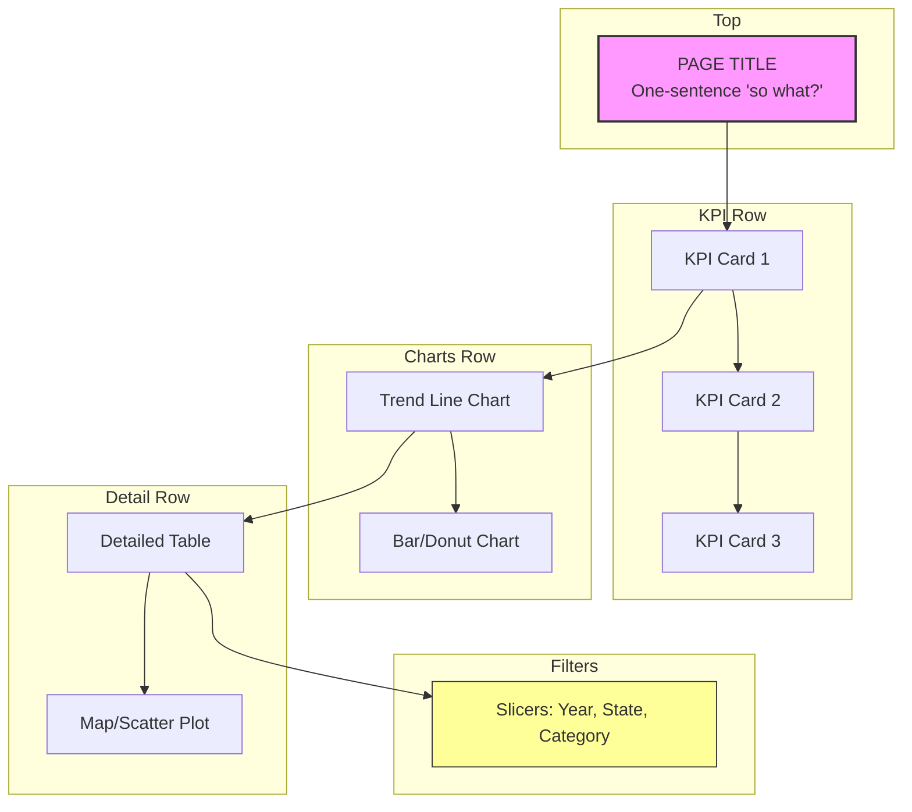

# Dashboard Design Framework — Marketing Funnel

This document outlines the design principles applied to the **Olist Marketing Funnel Dashboard**, ensuring it meets stakeholder needs and drives marketing budget decisions.

---

## D — Decision

Every dashboard page is built around a specific decision it enables:

| Page | Decision Enabled | Owner |
|------|------------------|-------|
| Funnel Overview | Should the VP of Marketing reallocate acquisition budget across channels? | VP Marketing |
| Channel Performance | Should the Head of Acquisition shift spend based on corrected LTV/MQL? | Head of Acquisition |
| Lead Quality | Which channels produce which seller profiles — and does Social's Wolf-heavy mix explain its conversion gap? | Head of Sales Ops |
| LTV Analysis | Should VP Marketing + VP Finance adjust channel investment based on corrected LTV/MQL? | VP Marketing & Finance |

**Decision Frequency:** Monthly for all pages (aligned with marketing review cycle).

---

## A — Audience

| Audience | Technical Level | Dashboard Implication |
|----------|-------------------|----------------------|
| VP Marketing | Low (focus on ROI, budget allocation) | Big picture callouts, trend lines, LTV comparisons |
| Acquisition Managers | Medium (mix of trends + detail) | Channel breakdowns, conversion by origin, lead behavior cross-tab |
| Sales Operations | High (need to drill into segments) | Filters, time-to-close by channel/behavior, detailed tables |

**Explicit Audience:** VP Marketing (primary), Acquisition Managers (secondary), Sales Ops (tertiary).

---

## S — Signal

Top 3–5 metrics per page that matter for the decision and audience:

### Funnel Overview (Page1)
1. **MQL Volume** (8,000 total) — Top-of-funnel health
2. **Conversion Rate** (10.5% overall) — Primary marketing KPI
3. **Deals Won** (842) — Pipeline output
4. **Time-to-Close** (24–44 days) — Sales cycle efficiency
5. **LTV/MQL by Channel** ($17–$96) — ROI driver for budget decisions

### Channel Performance (Page2)
1. **Conversion Rate by Origin** — Which channels convert best?
2. **LTV/MQL by Channel** — Which channels deliver highest lifetime value?
3. **Conversion vs Volume Scatter** — Bubble chart identifying efficiency outliers
4. **MQL Volume Mix** — Donut chart of acquisition mix

### Lead Quality (Page3)
1. **Lead Behavior Profile Distribution** — % Cat, Eagle, Wolf, Shark within closed deals
2. **Channel × Lead Behavior Cross-Tab** — Heatmap showing profile mix variation across channels
3. **Wolf Concentration by Channel** — Social's 17.3% Wolf rate vs 9.6–10.8% for other channels
4. **Time-to-Close by Profile** — Which profiles close fastest?

### LTV Analysis (Page4)
1. **LTV/MQL by Channel** — Corrected with LEFT JOIN (all MQLs in denominator)
2. **LTV/Seller by Channel** — Revenue per converted seller
3. **Revenue by Channel** — Total revenue contribution
4. **Cohort Retention of Sellers** — Month-by-month seller retention after acquisition

---

## H — Hierarchy

Visual hierarchy guides the viewer's eye deliberately:

### Rules of Thumb Applied
1. **Top to bottom, left to right** — most important first
2. **Start high-level** — KPI cards, overall trend lines
3. **Move to detailed** — breakdowns, segment views
4. **Color sparingly** — only when meaningful (e.g., red = late, green = on-time)
5. **60-second rule** — Can someone read the high-level story in 60 seconds?

### Page Structure Template

### Color Palette
- **Primary:** `#1f77b4` (blue) — revenue, positive metrics
- **Secondary:** `#ff7f0e` (orange) — warnings, late deliveries
- **Neutral:** `#2ca02c` (green) — on-time, positive performance
- **Text:** `#333333` (dark gray) — all labels and titles

---

## Implementation Checklist

- [x] Consistent color palette (2–3 colors max) across all pages
- [x] All axis labels readable (font size ≥ 11pt)
- [x] No chart titles that restate chart type ("Bar Chart")
- [x] KPI cards show comparison context (vs. prior period)
- [x] Slicers clearly labeled and visible on all pages
- [x] No chart uses more than 6 colors at once
- [x] Removed unnecessary gridlines
- [x] Page navigation buttons between pages
- [x] Text box on each page with 1-sentence "so what"

---

*Framework based on the DASH methodology for stakeholder dashboard design.*
