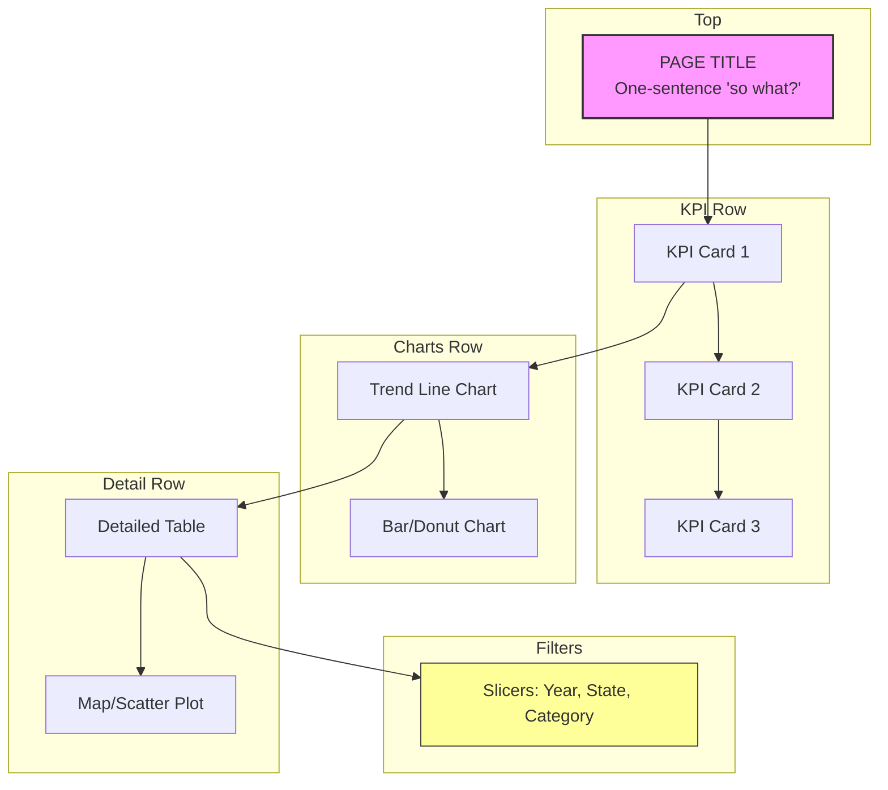

# Dashboard Design Framework

This document outlines the design principles applied to the Olist Sales & Operations Dashboard, ensuring it meets stakeholder needs and drives decision-making.

---

## D — Decision

Every dashboard page is built around a specific decision it enables:

| Page | Decision Enabled | Owner |
|------|------------------|-------|
| Funnel Overview | Should the VP of Marketing reallocate acquisition budget across channels? | VP Marketing |
| Channel Performance | Should the Head of Acquisition shift spend from Organic to Paid Search? | Head of Acquisition |
| Lead Quality | Should the Head of Sales Ops change SDR prioritization rules based on lead behavior × channel? | Head of Sales Ops |
| LTV Analysis | Should the VP Marketing + VP Finance adjust channel investment based on true LTV/MQL? | VP Marketing & Finance |

**Decision Frequency:** Monthly for all pages (aligned with business review cycle).

---

## A — Audience

The same data is presented differently depending on the audience:

| Audience | Technical Level | Dashboard Implication |
|----------|-------------------|----------------------|
| Executives / Leadership | Low (focus on outcomes) | Big picture callouts, trend lines, minimal numbers |
| Managers / Category Leads | Medium (mix of trends + detail) | Charts + summary tables, drill-through enabled |
| Analysts / Data Teams | High (need to explore) | Filters, dimension breakdowns, detailed tables |

**Explicit Audience for This Dashboard:** Sales & Operations Leadership (primary), Category Managers (secondary).

---

## S — Signal

Top 3–5 metrics per page that matter for the decision and audience:

### Executive Overview (Page1)
1. **Revenue** (total + trend) — Is the business growing?
2. **Order Volume** (total + trend) — Are we busy enough?
3. **AOV** (avg order value) — Are customers spending more?
4. **On-Time Delivery Rate** — Are we meeting promises?
5. **Avg Review Score** — Are customers satisfied?

### Customer Analysis (Page2)
1. **Customer Count by State** — Where are our customers?
2. **AOV by State** — Which markets are premium?
3. **Repeat Customer Rate** — Are customers coming back?
4. **Revenue by Payment Type** — How do customers pay?

### Product & Category (Page3)
1. **Revenue by Category** — What drives revenue?
2. **Avg Review Score by Category** — What delights customers?
3. **Freight Cost % by Category** — What's expensive to ship?
4. **Category Performance Matrix** — Revenue + Review + Volume combined

### Seller Performance (Page4)
1. **Revenue per Seller** — Who are our top performers?
2. **Seller On-Time Rate** — Who is reliable?
3. **Review Score by Seller** — Who delivers quality?
4. **Seller Count by State** — Where are sellers located?

### Logistics & Delivery (Page5)
1. **On-Time Delivery Rate by State** — Where are bottlenecks?
2. **Avg Delivery Days Trend** — Are we getting faster?
3. **Late Delivery Rate by Category** — Which categories cause delays?
4. **Freight Cost % by State** — Which regions are expensive to serve?

---

### Sales Mix: A Particularly Useful Metric View

"Mix" shows the distribution of a dimension within a metric over time:

- **Absolute view (line chart):** Total revenue by category over time — shows magnitude and trends
- **Mix view (area chart as % of total):** Each category's share of total revenue — shows whether a dip was concentrated in one category or spread evenly
- **Combined:** Reveals whether dips are category-specific (product issue) or macro trends (company-wide problem)

**SQL Source:** `olist.kpi_sales_mix` view (absolute revenue + % of total by category by month)
1. **On-Time Delivery Rate by State** — Where are bottlenecks?
2. **Avg Delivery Days Trend** — Are we getting faster?
3. **Late Delivery Rate by Category** — Which categories cause delays?
4. **Freight Cost % by State** — Which regions are expensive to serve?

---

## H — Hierarchy

Visual hierarchy guides the viewer's eye deliberately:

### Rules of Thumb Applied
1. **Top to bottom, left to right** — most important first
2. **Start high-level** — KPI cards, overall trend lines
3. **Move to detailed** — breakdowns, segment views
4. **Color sparingly** — only when meaningful (e.g., red = late, green = on-time)
5. **60-second rule** — Can someone read the high-level story in 60 seconds?

### Page Structure Template

### Color Palette
- **Primary:** `#1f77b4` (blue) — revenue, positive metrics
- **Secondary:** `#ff7f0e` (orange) — warnings, late deliveries
- **Neutral:** `#2ca02c` (green) — on-time, positive performance
- **Text:** `#333333` (dark gray) — all labels and titles

---

## Implementation Checklist

- [x] Consistent color palette (2–3 colors max) across all pages
- [x] All axis labels readable (font size ≥ 11pt)
- [x] No chart titles that restate chart type ("Bar Chart")
- [x] KPI cards show comparison context (vs. prior period)
- [x] Slicers clearly labeled and visible on all pages
- [x] No chart uses more than 6 colors at once
- [x] Removed unnecessary gridlines
- [x] Page navigation buttons between pages
- [x] Text box on each page with 1-sentence "so what"

---

*Framework based on the DASH methodology for stakeholder dashboard design.*
