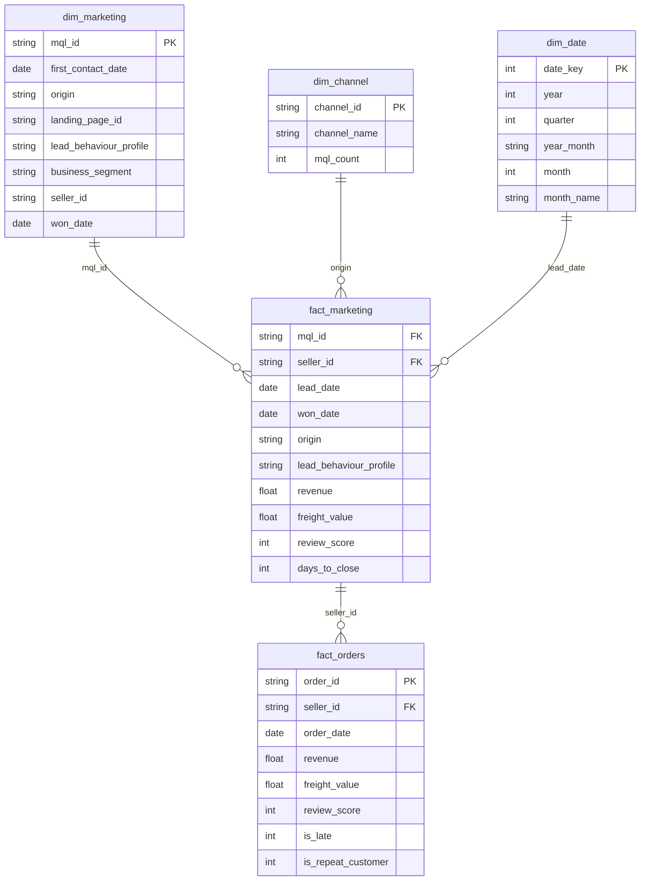
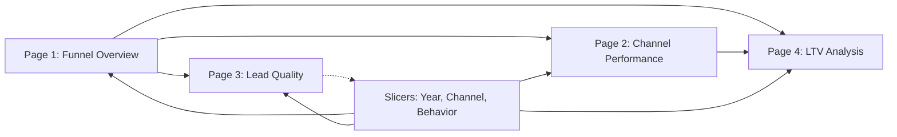

# Power BI Build Guide — Marketing Funnel Dashboard

Step-by-step guide to building the Olist Marketing Funnel Dashboard in Power BI Desktop. Covers data model connections, page layouts, visuals, and slicers.

---

## 1. Data Model (Star Schema)

Connect Power BI to `localhost:5433`, database `olist`. Import the following views:



### Key Relationships

| From | To | Cardinality | Join Key |
|------|----|-------------|----------|
| `dim_marketing` | `fact_marketing` | 1:* | `mql_id` |
| `dim_channel` | `fact_marketing` | 1:* | `origin` |
| `dim_date` | `fact_marketing` | 1:* | `lead_date` → `date_key` |
| `fact_marketing` | `fact_orders` | 1:* | `seller_id` |

**Filter direction:** Single (cross-filter) for all relationships. `dim_channel` filters `fact_marketing` which filters `fact_orders`.

### LTV Calculation Note

The `fact_marketing` view uses `LEFT JOIN` so all MQLs (including non-converting) are preserved. LTV/MQL = `SUM(revenue) / COUNT(DISTINCT mql_id)`. The `fact_orders` join via `seller_id` means only sellers with orders contribute revenue — MQLs without deals or sellers without orders contribute $0.

---

## 2. SQL Views Reference

| View | Purpose | Source |
|------|---------|--------|
| `olist.kpi_mql_volume` | MQL count by month + channel | `phase5_funnel.py:36` |
| `olist.kpi_conversion_rate` | Conversion % by channel | `phase5_funnel.py:52` |
| `olist.kpi_ltv_by_channel` | LTV per MQL, per seller (LEFT JOIN) | `phase5_funnel.py:71` |
| `olist.kpi_lead_behavior` | Lead profile distribution within closed deals | `phase5_funnel.py:90` |
| `olist.kpi_time_to_close` | Avg days to close by month | `phase5_funnel.py:121` |
| `olist.kpi_channel_lead_behavior` | Channel × Lead Behavior cross-tab | `phase5_funnel.py:137` |
| `olist.kpi_monthly_trend` | MQL volume × conversion × close-time by month | `phase5_funnel.py:200` |

These are pre-built views. Import directly into Power BI as query tables.

---

## 3. Page-by-Page Build Guide

### Page 1: Marketing Funnel Overview

**Decision:** *Should the VP of Marketing reallocate budget across channels?*

```
┌─────────────────────────────────────────────────────────────┐
│  Is the funnel healthy, and which channels drive results?   │
├──────────┬──────────┬────────────┬──────────────┬───────────┤
│ MQL Vol  │ Conv     │ Deals Won  │ Time-to-Close│ [Slicers]│
│ 8,000    │ 10.5%    │ 842        │ 24-44 days   │          │
├──────────┴──────────┴────────────┴──────────────┴───────────┤
│                                                             │
│  [MQL Volume Trend — line: monthly MQLs by channel]         │
│  [MQL Volume by Channel — bar: MQLs per origin]            │
│  [Deals Won by Month — line: closed deals over time]        │
│                                                             │
└─────────────────────────────────────────────────────────────┘
```

**KPI Cards (top row):**

| Metric | Value | Source |
|--------|-------|--------|
| MQL Volume | 8,000 | `dim_marketing` COUNT |
| Conversion Rate | 10.5% | `kpi_conversion_rate` |
| Deals Won | 842 | `dim_marketing` WHERE `seller_id` NOT NULL |
| Avg Time-to-Close | 24–44 days | `kpi_time_to_close` |

**Visuals:**

| Visual | Type | Source | Configuration |
|--------|------|--------|---------------|
| MQL volume trend | Line chart | `kpi_mql_volume` | X: month, Y: SUM(mql_count), Legend: origin. Add conversion % annotation line |
| MQL volume by channel | Bar chart | `kpi_mql_volume` | Axis: origin, Value: SUM(mql_count), sort descending |
| Deals won by month | Line chart | `kpi_time_to_close` | X: month, Y: deals_won |

**Slicers (top-right, always visible):**
- Year (from `dim_date.year`)
- Channel (from `dim_channel.channel_name`)
- Lead Behavior (from `dim_marketing.lead_behaviour_profile`)

**Business narrative (text box):**
> *"Should the VP of Marketing reallocate budget across channels?"*

---

### Page 2: Channel Performance

**Decision:** *Should the Head of Acquisition shift spend based on corrected LTV/MQL?*

```
┌─────────────────────────────────────────────────────────────┐
│  Which channels deliver the best conversion × LTV?          │
├─────────────┬──────────────┬────────────┬───────────────────┤
│  [Slicers]  │              │            │                   │
├─────────────┴──────────────┴────────────┴───────────────────┤
│  [Conversion Rate by Origin — horizontal bar, sorted desc]  │
│  [LTV per MQL by Channel — bar: $17–$96 range]              │
│  [Conversion vs LTV Scatter — X: conv rate, Y: LTV/MQL,    │
│   bubble size: MQL volume]                                  │
│  [Channel Volume Mix — donut: MQL % by origin]              │
└─────────────────────────────────────────────────────────────┘
```

**Visuals:**

| Visual | Type | Source | Configuration |
|--------|------|--------|---------------|
| Conversion rate by origin | Horizontal bar | `kpi_conversion_rate` | Y: origin, X: conversion_rate_pct, sort desc |
| LTV per MQL by channel | Bar | `kpi_ltv_by_channel` | Axis: origin, Value: ltv_per_mql |
| Conversion vs LTV scatter | Scatter | `kpi_conversion_rate` + `kpi_ltv_by_channel` | X: conversion_rate_pct, Y: ltv_per_mql, Size: total_mqls |
| Channel volume mix | Donut | `kpi_mql_volume` | Legend: origin, Value: SUM(mql_count) |

**Business narrative (text box):**
> *"Should the Head of Acquisition shift spend from Organic to Paid Search based on conversion and LTV data?"*

---

### Page 3: Lead Quality

**Decision:** *Which channels produce which seller profiles — and does Social's Wolf-heavy mix explain its conversion gap?*

**Data caveat:** Lead behavior profiles (Cat/Eagle/Wolf/Shark) are recorded at deal stage, not MQL stage. They describe closed deal composition, not conversion likelihood.

```
┌─────────────────────────────────────────────────────────────┐
│  What does the profile mix tell us about channel quality?   │
├─────────────┬──────────────┬────────────┬───────────────────┤
│  [Slicers]  │              │            │                   │
├─────────────┴──────────────┴────────────┴───────────────────┤
│  [Profile Distribution — bar: % Cat/Eagle/Wolf/Shark]       │
│  [Channel × Behavior Cross-Tab — heatmap: rows=channel,     │
│   cols=behavior, fill=% of channel deals]                  │
│  [Time-to-Close by Profile — bar: avg days per profile]    │
│  [Profile Mix — donut: overall closed deal composition]     │
└─────────────────────────────────────────────────────────────┘
```

**Visuals:**

| Visual | Type | Source | Configuration |
|--------|------|--------|---------------|
| Profile distribution | Bar | `kpi_lead_behavior` | Axis: lead_group, Value: pct_of_closed_deals |
| Channel × Behavior cross-tab | Matrix/Heatmap | `kpi_channel_lead_behavior` | Rows: origin, Columns: lead_group, Values: pct_of_channel_deals. Conditional formatting by value |
| Time-to-close by profile | Bar | `kpi_time_to_close` sliced by `lead_behaviour_profile` | Axis: lead_group, Value: avg_days_to_close |
| Profile composition | Donut | `kpi_lead_behavior` | Legend: lead_group, Value: closed_deals |

**Business narrative (text box):**
> *"Which channels produce which seller profiles — and does Social's Wolf-heavy mix (17.3%) explain its conversion gap?"*

---

### Page 4: LTV Analysis

**Decision:** *Should VP Marketing + VP Finance adjust channel investment based on corrected LTV/MQL?*

```
┌─────────────────────────────────────────────────────────────┐
│  What is the long-term value of each channel?               │
├─────────────┬──────────────┬────────────┬───────────────────┤
│  [Slicers]  │              │            │                   │
├─────────────┴──────────────┴────────────┴───────────────────┤
│  [Revenue by Channel — stacked bar: total $ per origin]     │
│  [LTV/MQL by Channel — bar: $/MQL, sorted desc]             │
│  [LTV/Seller by Channel — bar: $/seller, sorted desc]      │
│  [Cohort Retention — heat table: acquisition month rows,   │
│   month-index columns, fill = retention rate]               │
└─────────────────────────────────────────────────────────────┘
```

**Visuals:**

| Visual | Type | Source | Configuration |
|--------|------|--------|---------------|
| Revenue by channel | Stacked bar | `kpi_ltv_by_channel` | Axis: origin, Value: total_revenue |
| LTV/MQL by channel | Bar | `kpi_ltv_by_channel` | Axis: origin, Value: ltv_per_mql, sort desc |
| LTV/Seller by channel | Bar | `kpi_ltv_by_channel` | Axis: origin, Value: ltv_per_seller |
| Cohort retention | Matrix/Heatmap | `olist.cohort_retention` | Rows: cohort_month, Columns: month_index, Values: retention_rate. Conditional formatting |

**Business narrative (text box):**
> *"Which channels deliver the highest LTV/MQL after correcting the denominator — and does the gap justify budget shifts?"*

---

## 4. DASH Framework (Consolidated)

### D — Decision

| Page | Decision Enabled | Owner | Frequency |
|------|------------------|-------|-----------|
| Funnel Overview | Should the VP of Marketing reallocate budget across channels? | VP Marketing | Monthly |
| Channel Performance | Should the Head of Acquisition shift spend based on corrected LTV/MQL? | Head of Acquisition | Monthly |
| Lead Quality | Do channel profile differences (e.g., Social's Wolf mix) explain conversion gaps? | Head of Sales Ops | Quarterly |
| LTV Analysis | Should VP Marketing + VP Finance adjust channel investment based on corrected LTV/MQL? | VP Marketing & Finance | Quarterly |

### A — Audience

| Audience | Technical Level | Dashboard Implication |
|----------|-----------------|----------------------|
| VP Marketing | Low (focus on ROI, budget) | KPI callouts, trend lines, LTV comparisons |
| Acquisition Managers | Medium (mix of trends + detail) | Channel breakdowns, conversion by origin, cross-tab |
| Sales Operations | High (need to drill into segments) | Filters, time-to-close by channel/behavior, detailed tables |

### S — Signal (Key Metrics Per Page)

**Funnel Overview:** MQL Volume (8,000) → Conversion Rate (10.5%) → Deals Won (842) → Time-to-Close (24–44 days) → LTV/MQL ($17–$96)

**Channel Performance:** Conversion Rate by Origin → LTV/MQL by Channel → MQL Volume Mix

**Lead Quality:** Profile Distribution (%) → Channel × Behavior Cross-Tab → Wolf Concentration by Channel

**LTV Analysis:** LTV/MQL by Channel → LTV/Seller by Channel → Revenue by Channel → Cohort Retention

### H — Hierarchy

Page layout follows this structure on every page:

```
┌─────────────────────────────────────────────────────┐
│  PAGE TITLE (One-sentence "so what?")               │
├──────────┬──────────┬──────────┬────────────────────┤
│ KPI Card │ KPI Card │ KPI Card │ Slicers (Year,     │
│          │          │          │ Channel, Behavior)  │
├──────────┴──────────┴──────────┴────────────────────┤
│ [Primary Chart — trend or comparison]                │
├─────────────────────────────────────────────────────┤
│ [Secondary Chart — breakdown or distribution]        │
├─────────────────────────────────────────────────────┤
│ [Detail Table or Matrix — drill-through enabled]    │
└─────────────────────────────────────────────────────┘
```

---

## 5. Navigation Flow



All pages share global slicers (Year, Channel, Lead Behavior) for consistent filtering. Use Power BI's sync slicers feature across all 4 pages.

---

## 6. Color Palette

| Usage | Color | Hex | Applies To |
|-------|-------|-----|------------|
| Primary / Paid Search | Blue | `#1f77b4` | KPI cards, positive metrics |
| Secondary / Organic Search | Orange | `#ff7f0e` | Warnings, benchmarks |
| Neutral / Direct Traffic | Green | `#2ca02c` | Positive conversion rates |
| Social | Red | `#d62728` | Low conversion, Wolf alerts |
| Text | Dark gray | `#333333` | All labels and titles |

---

## 7. Slicer Configuration

| Slicer | Source Column | Type | Default |
|--------|---------------|------|---------|
| Year | `dim_date.year` | Dropdown | Select all |
| Channel | `dim_channel.channel_name` | Dropdown | Select all |
| Lead Behavior | `dim_marketing.lead_behaviour_profile` | Dropdown | Select all |
| Month | `dim_date.year_month` | Slider | Select all |

**Sync slicers** across all 4 pages using Power BI View → Sync Slicers pane.

---

## 8. Dashboard Design Checklist

- [ ] Consistent color palette (2–3 colors max) across all pages
- [ ] All axis labels readable (font size ≥ 11pt)
- [ ] No chart titles that restate the chart type
- [ ] KPI cards show comparison context (vs. prior period)
- [ ] Slicers clearly labeled and visible on all pages
- [ ] No chart uses more than 6 colors at once
- [ ] Remove all gridlines except necessary reference lines
- [ ] Page navigation buttons between pages
- [ ] A text box on each page with a 1-sentence "so what"
- [ ] Sync slicers enabled across all pages
- [ ] Drill-through enabled from Funnel Overview → Lead Quality
- [ ] Tooltips on KPI cards showing month-over-month change
